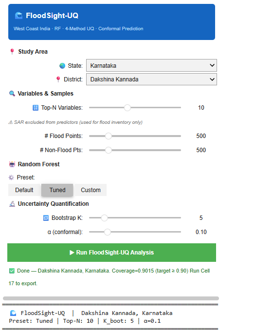
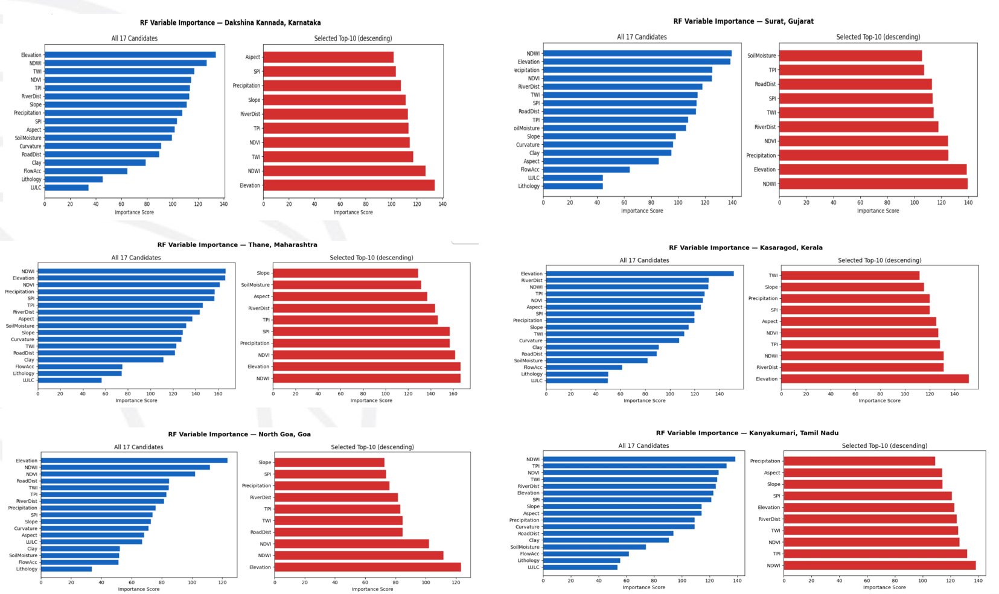
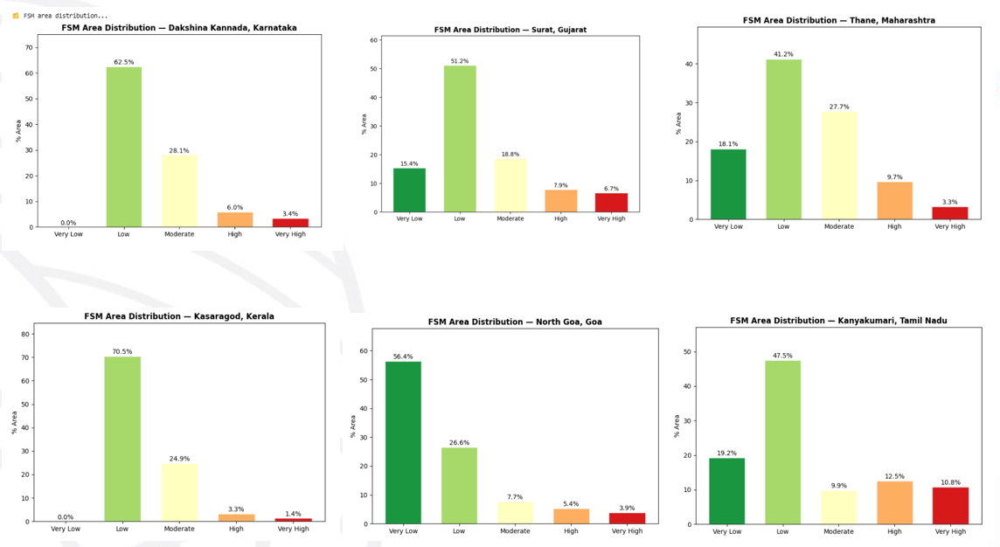
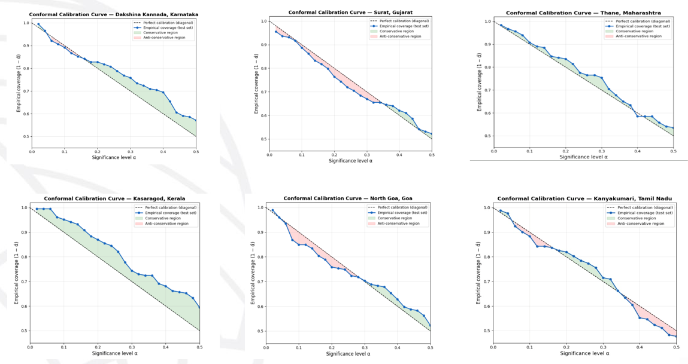
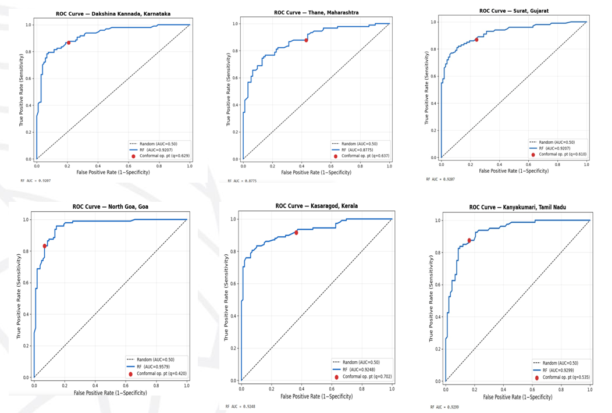
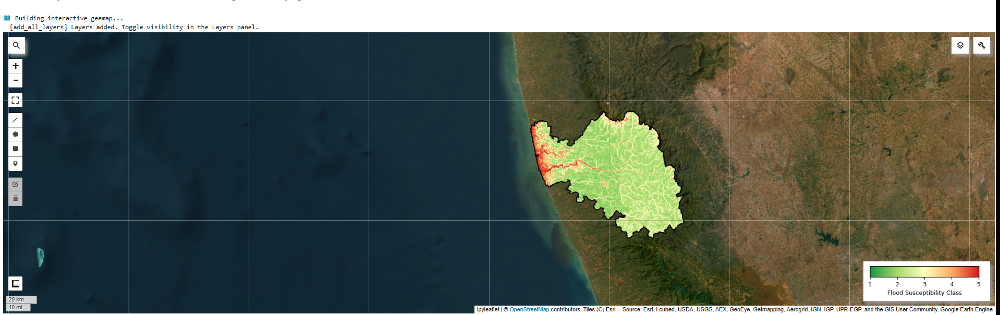

# 🌊 Uncertainty Analysis of Flood Susceptibility Mapping of the West Coast of India

## 📌 Project Overview

This project focuses on developing a flood susceptibility mapping system for the West Coast of India using geospatial data and machine learning techniques. The project analyzes multiple geospatial variables to identify areas with different levels of flood susceptibility.

A Random Forest model is used for flood susceptibility analysis, along with uncertainty analysis to assess the reliability of the model predictions. The results are evaluated using ROC-AUC analysis and presented through interactive geospatial visualizations.

## 🎯 Objectives

* Identify areas with different levels of flood susceptibility.
* Analyze the influence of multiple geospatial variables.
* Apply a Random Forest machine learning model for susceptibility mapping.
* Perform uncertainty and calibration analysis of the model predictions.
* Evaluate model performance using ROC-AUC.
* Visualize the results through interactive maps.

## 🛠️ Technologies & Methods

* **Google Earth Engine**
* **Random Forest**
* **Geospatial Analysis**
* **Remote Sensing / GIS**
* **Conformal Calibration**
* **ROC-AUC Evaluation**
* **Geemap**
* **17 Geospatial Variables**

## 🔬 Project Workflow

The project follows a workflow consisting of:

1. Define the study area.
2. Collect and prepare the required geospatial variables.
3. Process the input datasets.
4. Apply the Random Forest model.
5. Generate the Flood Susceptibility Map (FSM).
6. Analyze variable importance.
7. Perform uncertainty and conformal calibration analysis.
8. Evaluate the model using the ROC curve and AUC.
9. Visualize the results using an interactive geemap.

## 📊 Project Results

### 1. Study Area & Input Variables

Overview of the selected study region and the geospatial variables used for flood susceptibility analysis.

### 2. Random Forest Variable Importance

Shows the relative importance of the variables used by the Random Forest model in flood susceptibility prediction.

### 3. Flood Susceptibility Area Distribution

Shows the distribution of the study area across different flood susceptibility classes.

### 4. Conformal Calibration Analysis

Shows the conformal calibration curve used to analyze the reliability and uncertainty of the model predictions.

### 5. ROC-AUC Model Evaluation

The ROC curve is used to evaluate the performance of the flood susceptibility model.

### 6. Interactive Flood Susceptibility Map

An interactive geemap visualization of the flood susceptibility results across the study region.

## 🔑 Key Features

* Flood susceptibility mapping using machine learning.
* Analysis of multiple geospatial variables.
* Random Forest-based susceptibility prediction.
* Variable importance analysis.
* Uncertainty and conformal calibration analysis.
* ROC-AUC based model evaluation.
* Interactive geospatial visualization.

## 🎓 Project Type

**Major Project**

## 👩‍💻 Project Status

**Currently Implementing**
